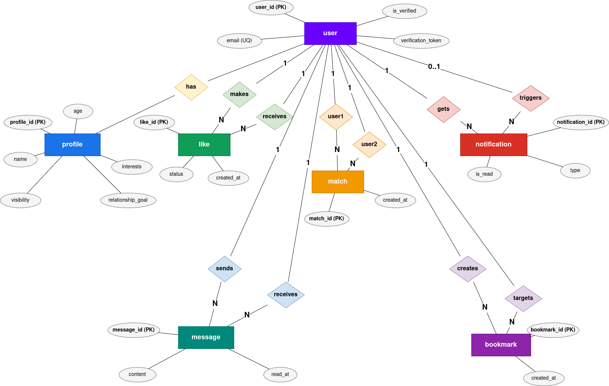

# DriftDater Database Design

This document describes the current DriftDater relational schema, its main relationships, indexing strategy, normalization status, and the migration setup used to create the database.

## 1. ER Diagram



### Core Entity
- **User**
  - Central entity of the system
  - Attributes: `user_id (PK)`, `email (UQ)`, `is_verified`, `verification_token`

### Related Entities

- **Profile (1:1 with User)**
  - Stores personal details
  - Attributes: `profile_id (PK)`, `name`, `age`, `interests`, `visibility`, `relationship_goal`

- **Like (User interaction)**
  - Represents a user liking another user
  - Attributes: `like_id (PK)`, `status`, `created_at`
  - Relationship: User *makes* and *receives* likes

- **Match (between two Users)**
  - Created when two users mutually like each other
  - Attributes: `match_id (PK)`, `created_at`
  - Links: `user1` and `user2`

- **Message (communication)**
  - Users send and receive messages
  - Attributes: `message_id (PK)`, `content`, `read_at`

- **Notification (system alerts)**
  - Triggered by events like likes, matches, or messages
  - Attributes: `notification_id (PK)`, `type`, `is_read`

- **Bookmark (saved users/items)**
  - Users can bookmark others
  - Attributes: `bookmark_id (PK)`, `created_at`

### Overall Flow
1. Users create profiles  
2. Users like each other  
3. Mutual likes create matches  
4. Matched users send messages  
5. Notifications are generated for interactions  
6. Users can bookmark others 

### Summary
This diagram models a full interaction cycle:
**User → Profile → Like → Match → Message → Notification → Bookmark**

## 2. Database Schema Documentation

### `users`

Stores authentication and account lifecycle data.

| Column | Type | Constraints | Purpose |
|-------|------|-------------|---------|
| `user_id` | Integer | PK | Internal user identifier |
| `email` | String(120) | NOT NULL, UNIQUE, INDEX | Login identity |
| `password_hash` | String(128) | NOT NULL | Hashed password |
| `is_verified` | Boolean | Default `False` | Email verification status |
| `verification_token` | String(64) | UNIQUE | Email verification token |
| `created_at` | DateTime | Default current UTC time | Account creation timestamp |
| `last_active` | DateTime | Default current UTC time | Latest activity timestamp |

### `profiles`

Stores public-facing dating profile data for a user. Each user can have at most one profile.

| Column | Type | Constraints | Purpose |
|-------|------|-------------|---------|
| `profile_id` | Integer | PK | Profile identifier |
| `user_id` | Integer | FK -> `users.user_id`, UNIQUE | One-to-one owner link |
| `name` | String(100) | NOT NULL | Display name |
| `age` | Integer | NOT NULL | Age used in discovery |
| `bio` | Text | Nullable | Free-form profile description |
| `preferred_age_min` | Integer | Default `18` | Minimum preferred age |
| `preferred_age_max` | Integer | Default `50` | Maximum preferred age |
| `interests` | JSON | Default empty list | Interest tags used by matching |
| `profile_picture` | String(255) | Nullable | Uploaded image filename |
| `visibility` | Boolean | Default `True` | Public/private profile flag |
| `gender` | String(50) | Nullable | User gender |
| `gender_preference` | String(50) | Default `all` | Match preference |
| `relationship_goal` | String(50) | Nullable | Desired relationship type |
| `occupation` | String(100) | Nullable | Occupation text |
| `created_at` | DateTime | Indexed | Profile creation timestamp |
| `updated_at` | DateTime | On update | Profile last modification timestamp |

### `likes`

Stores user actions in the matching flow. A user can only have one active row per target user.

| Column | Type | Constraints | Purpose |
|-------|------|-------------|---------|
| `like_id` | Integer | PK | Like/dislike/pass identifier |
| `from_user_id` | Integer | FK -> `users.user_id` | Acting user |
| `to_user_id` | Integer | FK -> `users.user_id` | Target user |
| `status` | String(20) | Default `liked` | `liked`, `disliked`, or `passed` |
| `created_at` | DateTime | Indexed | Action timestamp |

Constraint: `UNIQUE(from_user_id, to_user_id)`

### `matches`

Stores mutual matches between two users.

| Column | Type | Constraints | Purpose |
|-------|------|-------------|---------|
| `match_id` | Integer | PK | Match identifier |
| `user1_id` | Integer | FK -> `users.user_id` | First matched user |
| `user2_id` | Integer | FK -> `users.user_id` | Second matched user |
| `created_at` | DateTime | Indexed | Match timestamp |

Constraint: `UNIQUE(user1_id, user2_id)`

### `notifications`

Stores in-app notification events for likes, matches, and messages.

| Column | Type | Constraints | Purpose |
|-------|------|-------------|---------|
| `notification_id` | Integer | PK | Notification identifier |
| `user_id` | Integer | FK -> `users.user_id` | Notification recipient |
| `type` | String(50) | NOT NULL | Notification category |
| `message` | String(255) | NOT NULL | Notification text |
| `from_user_id` | Integer | FK -> `users.user_id`, Nullable | User who triggered the event |
| `is_read` | Boolean | Default `False` | Read/unread state |
| `created_at` | DateTime | Indexed | Creation timestamp |

### `messages`

Stores chat messages between matched users.

| Column | Type | Constraints | Purpose |
|-------|------|-------------|---------|
| `message_id` | Integer | PK | Message identifier |
| `sender_id` | Integer | FK -> `users.user_id` | Sending user |
| `receiver_id` | Integer | FK -> `users.user_id` | Receiving user |
| `content` | Text | NOT NULL | Message body |
| `created_at` | DateTime | Indexed | Message timestamp |
| `read_at` | DateTime | Nullable | Read receipt timestamp |

### `bookmark`

Stores user-saved profiles for later review.

| Column | Type | Constraints | Purpose |
|-------|------|-------------|---------|
| `bookmark_id` | Integer | PK | Bookmark identifier |
| `user_id` | Integer | FK -> `users.user_id` | User creating bookmark |
| `bookmarked_user_id` | Integer | FK -> `users.user_id` | Saved target user |
| `created_at` | DateTime | Indexed | Bookmark timestamp |

Constraint: `UNIQUE(user_id, bookmarked_user_id)`

## 3. Normalization Review

### Normalized Areas

The core transactional schema is normalized around single-subject tables:

- `users` stores authentication data only.
- `profiles` stores profile attributes only.
- `likes`, `matches`, `messages`, `notifications`, and `bookmark` each model one relationship or event type.
- Non-key attributes depend on the whole key of their table and not on other non-key attributes.

This means the main entity and event tables follow the spirit of 3rd Normal Form for user, match, message, notification, and bookmark data.

### Important Design Note

`profiles.interests` is currently stored as a JSON array. That is a pragmatic application choice, but it is not strict textbook 3NF because interests are multi-valued data embedded inside one column rather than being decomposed into:

- `interests`
- `profile_interests`

If strict minimum 3NF compliance is required for assessment purposes, the next schema improvement should be:

1. Create an `interests` lookup table.
2. Create a `profile_interests` junction table.
3. Migrate the existing JSON values into that junction table.

All other current tables are already structured in a normalized relational form.

## 4. Indexing Strategy

The schema includes indexes for the highest-frequency lookup paths in the application.

### Unique and Identity Indexes

- `users.email`
- `users.verification_token`
- `profiles.user_id`
- `likes(from_user_id, to_user_id)`
- `matches(user1_id, user2_id)`
- `bookmark(user_id, bookmarked_user_id)`

### Query-Performance Indexes

- `profiles(visibility, created_at)` for visible profile browsing and sorting
- `profiles(gender, age)` for search filters
- `profiles.relationship_goal` for search filtering
- `likes(to_user_id, status)` for reverse-like and notification checks
- `matches(user1_id, created_at)` and `matches(user2_id, created_at)` for match retrieval
- `notifications(user_id, is_read, created_at)` for inbox and unread counts
- `notifications(from_user_id)` for sender-linked lookups
- `messages(receiver_id, read_at)` for unread message counts
- `messages(sender_id, receiver_id, created_at)` and `messages(receiver_id, sender_id, created_at)` for conversation history
- `bookmark(user_id, created_at)` for favorites listing

## 5. Migration Scripts

Migration support is enabled through Flask-Migrate and Alembic.

### Files Added

- `migrations/env.py`
- `migrations/alembic.ini`
- `migrations/script.py.mako`
- `migrations/versions/96c9b7554393_initial_schema.py`

### Important Application Change

`app/__init__.py` no longer calls `db.create_all()` during startup. That is necessary because automatic table creation bypasses Alembic and prevents clean migration-based database bootstrapping.

### Migration Commands

Initialize or apply the schema with:

```bash
flask --app run.py db upgrade
```

Create a new revision after future model changes:

```bash
flask --app run.py db migrate -m "Describe schema change"
flask --app run.py db upgrade
```

### Verification Status

The initial migration was verified against a fresh SQLite database using:

```bash
SQLALCHEMY_DATABASE_URI=sqlite:////tmp/driftdater_upgrade_test.db flask --app run.py db upgrade
```

That command completed successfully and produced the initial schema from migration scripts.
