# DriftDater User Manual

A complete guide to using DriftDater dating application.

---

## 1. Getting Started

### Creating an Account

1. Navigate to http://localhost:5173
2. Click **Register** in the header
3. Fill in the registration form:
   - Email address (must be valid to receive verification)
   - Password (secure password recommended)
4. Click **Create Account**
5. Check your email for the verification link

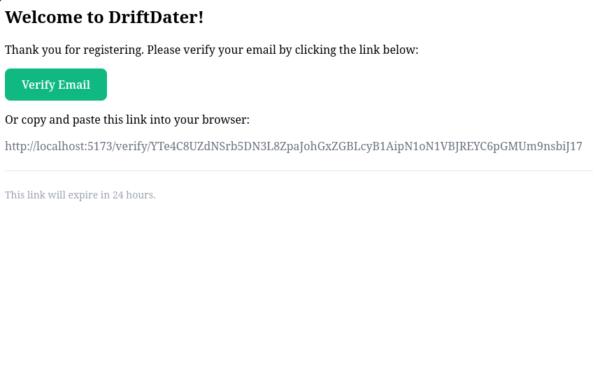

### Logging In

1. Click **Login** in the header
2. Enter your email and password
3. Click **Login**
4. You'll be redirected to the browse page

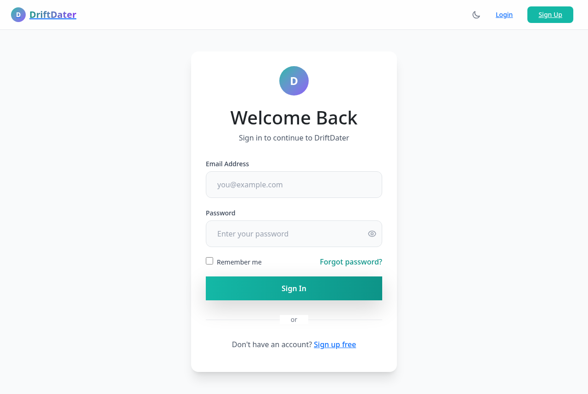

### Logging Out

Click your profile avatar in the header, then select **Logout**.

---

## 2. Profile Setup

Your profile is what other users see. Make it stand out!

### Creating Your Profile

1. After first login, you'll be prompted to create your profile
2. Fill in the following fields:

| Field | Description | Required |
|-------|-------------|----------|
| Name | Your display name | Yes |
| Age | Your age (18+) | Yes |
| Bio | About yourself | No |
| Interests | Hobbies, activities (comma-separated) | No |
| Gender | Male/Female/Other/Prefer not to say | Yes |
| Occupation | Your job | No |
| Relationship Goals | What you're looking for | Yes |

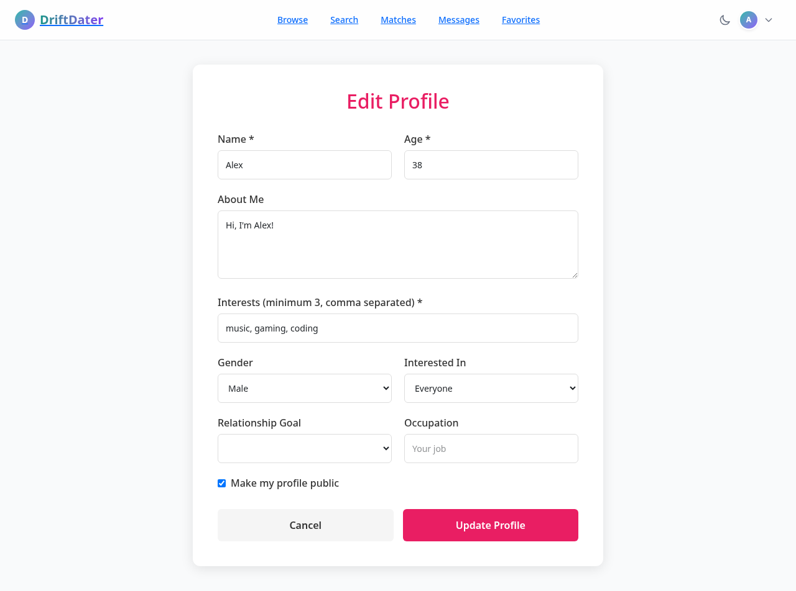

### Setting Age Preferences

Set the age range of matches you're interested in:

- **Minimum Age:** 18
- **Maximum Age:** 99

### Uploading a Profile Picture

1. Go to your profile settings
2. Click **Upload Picture** or the camera icon
3. Select an image from your device
4. The image will be cropped to fit

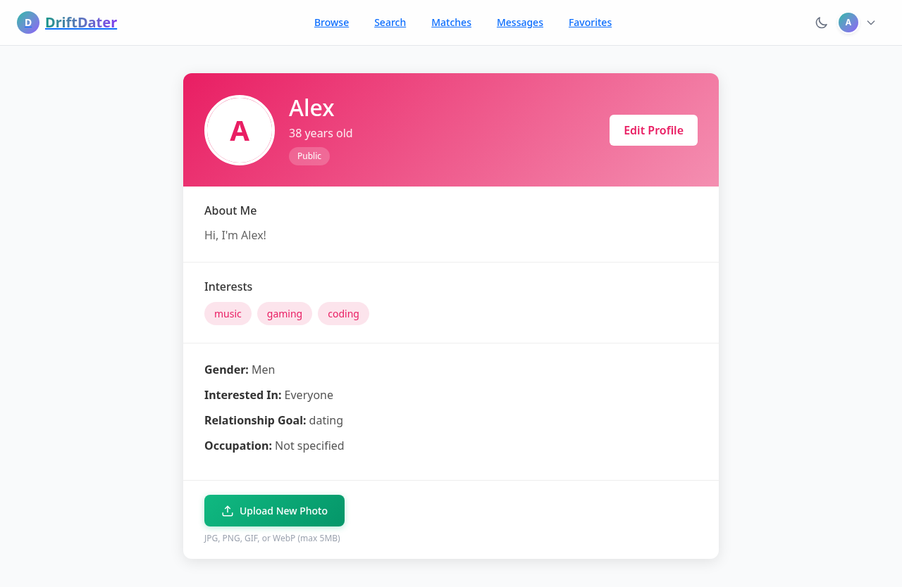

### Profile Visibility

Control who can view your profile:

| Setting | Description |
|---------|-------------|
| Public | Anyone can view your profile |
| Private | Only logged-in users can view |

Select your preferred visibility in profile settings.

---

## 3. Discovery & Matching

### Browsing Potential Matches

1. Click **Browse** in the navigation menu
2. You'll see profile cards with:
   - Profile picture
   - Name and age
   - Brief bio
   - Shared interests

3. Use the action buttons:
   - **Like** - Express interest
   - **Dislike** - Skip the profile
   - **Pass** - Hide temporarily

### Understanding the Matching Algorithm

DriftDater uses a scoring system (75 points max) to determine compatibility:

| Criterion | Points | Description |
|-----------|--------|-------------|
| Age | 20 | User within your preferred age range |
| Interests | 20 | Shared interests (+10 each, max 2) |
| Relationship Goal | 20 | Same goal as you |
| Gender Preference | 15 | Matches your preference |

**Minimum score: 50 points** to appear in your potential matches.

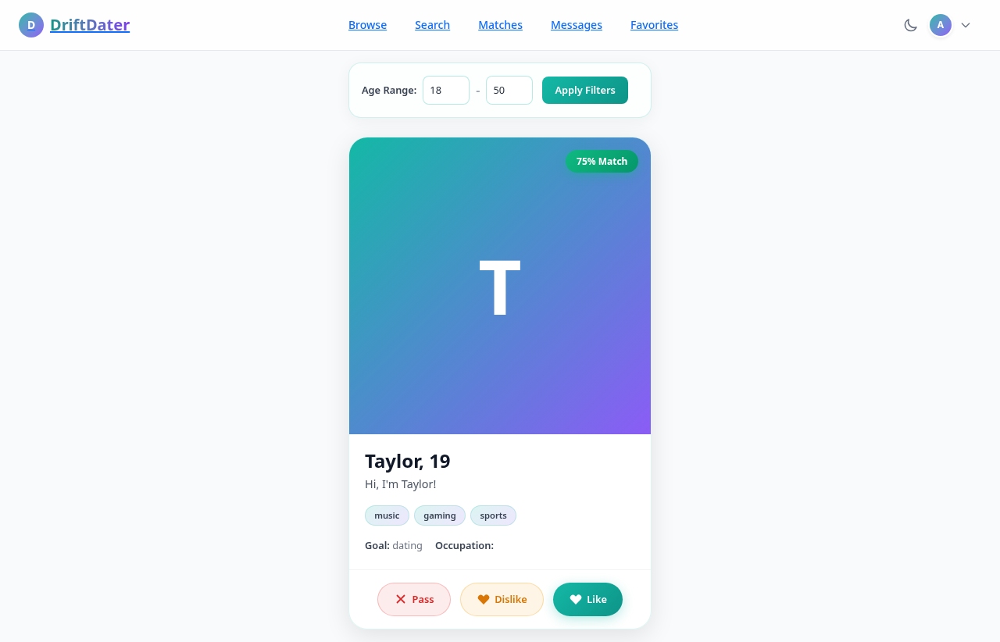

### Mutual Matches

When you like someone and they like you back, it's a mutual match!

1. Go to **Matches** in the navigation
2. You'll see all mutual matches sorted by most recent
3. Click on a match to start messaging

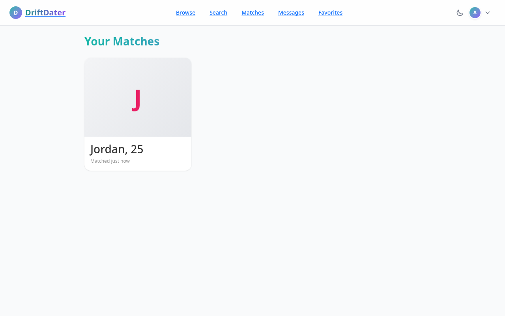

### Filtering Matches

Filter potential matches by:

- **Age range** - Within your preferred age settings
- **Interests** - Shared hobbies or activities
- **Applied filters** - Your saved search criteria

---

## 4. Messaging

Only mutual matches can message each other.

### Starting a Conversation

1. Go to **Matches**
2. Click on a match's profile or name
3. Type your message in the chat box
4. Press Enter or click **Send**

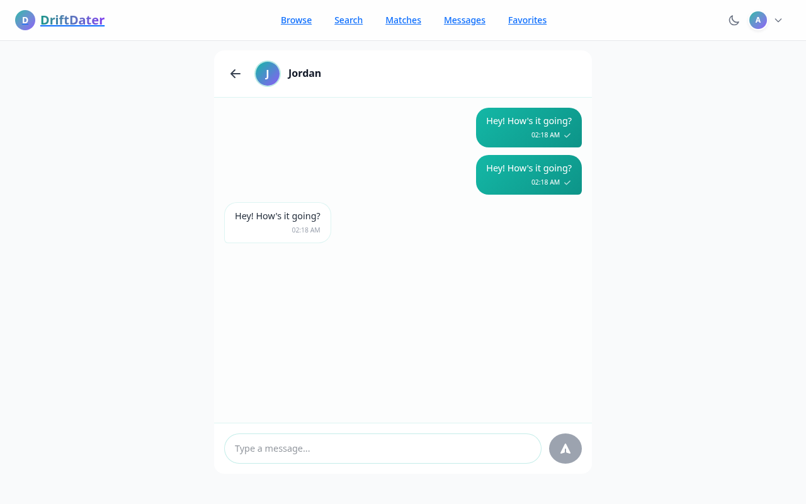

### Message Limits

- **Maximum length:** 1,000 characters per message
- **Auto-cleanup:** Messages older than 90 days are automatically deleted

### Conversation List

1. Click **Messages** in the navigation
2. See all your conversations
3. Unread message count shown on each conversation
4. Most recent conversation appears at top

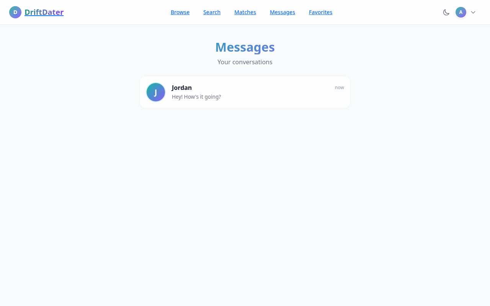

---

## 5. Search & Bookmarks

### Advanced Search

1. Click **Search** in the navigation
2. Apply filters:

| Filter | Options |
|--------|---------|
| Age Range | Min/Max (e.g., 25-35) |
| Interests | Select from list |
| Gender | Male/Female/All |
| Relationship Goal | Casual/Serious/Marriage |
| Occupation | Text search |

3. **Sort by:**
   - Newest first
   - Oldest first
   - Most similar (match score)
   - Age (ascending/descending)

4. Click **Search** to see results

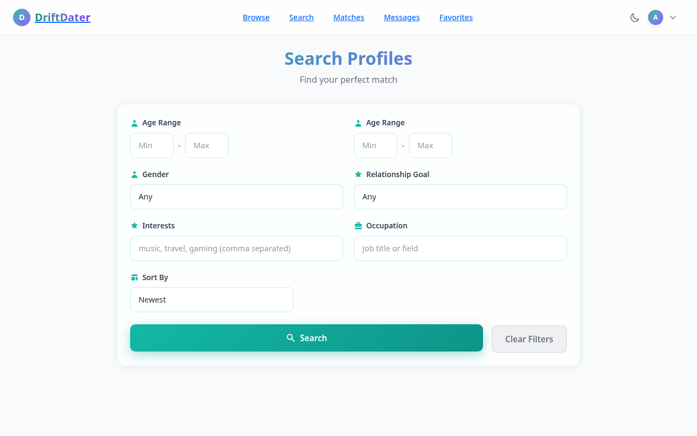

### Filtering Applied Matches

Toggle **Hide Applied** to exclude profiles you've already liked, disliked, or passed on.

### Bookmarking Profiles

Save profiles you like for later:

1. View a profile
2. Click the **bookmark icon** 
3. Go to **Favorites** to view all bookmarked profiles

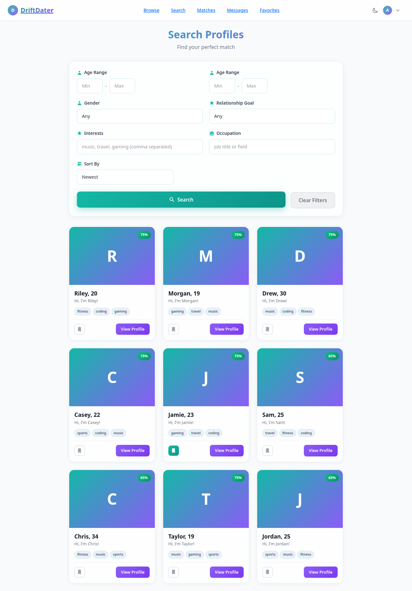

### Managing Favorites

1. Click **Favorites** in the navigation
2. See all bookmarked profiles
3. Click to view full profile
4. Remove bookmarks with the same bookmark icon

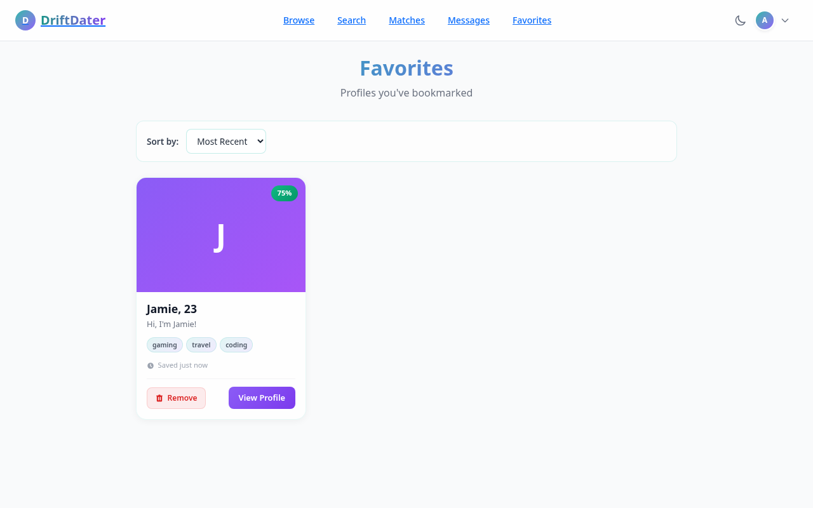

---

## 6. Notifications

### Real-Time Notifications

DriftDater sends instant notifications via WebSocket:

- **New Match!** - When someone likes you back
- **New Like** - When someone likes your profile
- **New Message** - When you receive a message

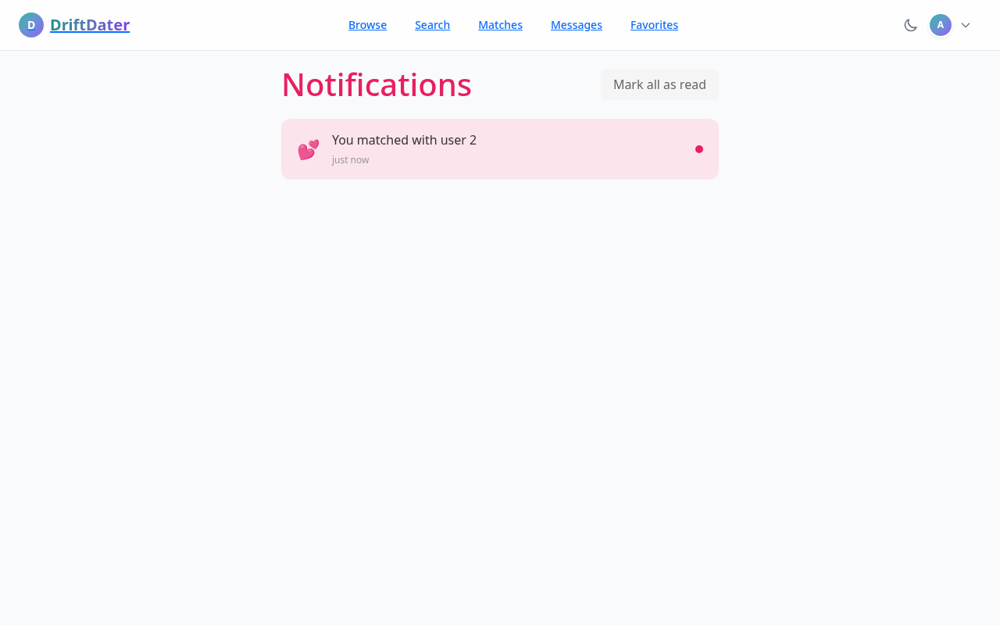

### Notification Types

| Type | Description |
|------|-------------|
| Match | Mutual match occurred |
| Like | Someone liked you |
| Message | New message received |

### Managing Notifications

1. Click the notification bell icon in the header
2. View all notifications
3. Mark individual notifications as read
4. **Mark All Read** to clear all

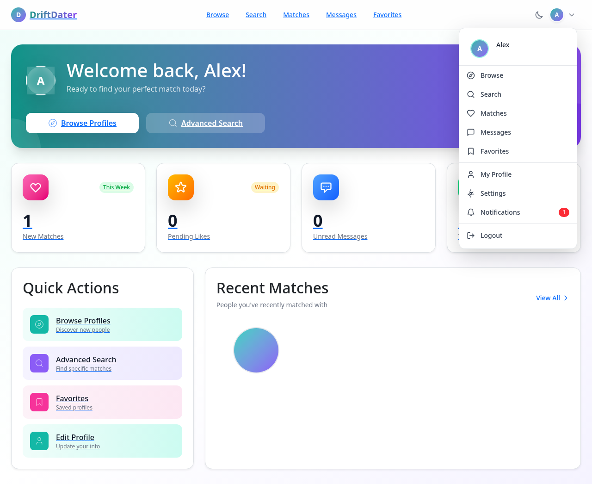

### Unread Count

The number badge on the notification icon shows unread count.

---

## 7. Quick Reference

### Navigation

| Menu Item | Page |
|----------|------|
| Browse | Discover potential matches |
| Matches | View mutual matches |
| Messages | Chat conversations |
| Search | Advanced search |
| Favorites | Bookmarked profiles |
| Profile | Your profile settings |

### Keyboard Shortcuts

| Key | Action |
|-----|--------|
| Enter | Send message |
| Escape | Close modal |

### Getting Help

- Check the FAQ in this manual
- Contact support through the app
- Report bugs via the feedback form

---

## Frequently Asked Questions

### Q: Why don't I see any potential matches?
A: Your preferences may be too narrow. Try expanding your age range or adjusting interests. Remember, users need a 50+ match score to appear.

### Q: Can I change my age preferences?
A: Yes, go to Profile > Settings > Age Preferences.

### Q: What happens to messages after 90 days?
A: They are automatically deleted for privacy.

### Q: Can I undo a Like or Pass?
A: No. Once you Like, Dislike, or Pass, that action is final. Use the bookmark feature to save profiles you want to revisit.

### Q: How do I know if someone read my message?
A: Look for the double-checkmark (✓✓) symbol.

---

*For support, contact: support@driftdater.example.com*
